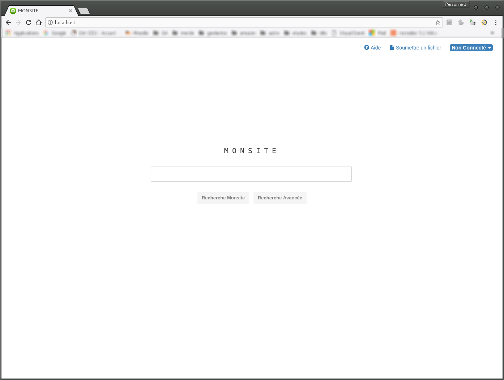
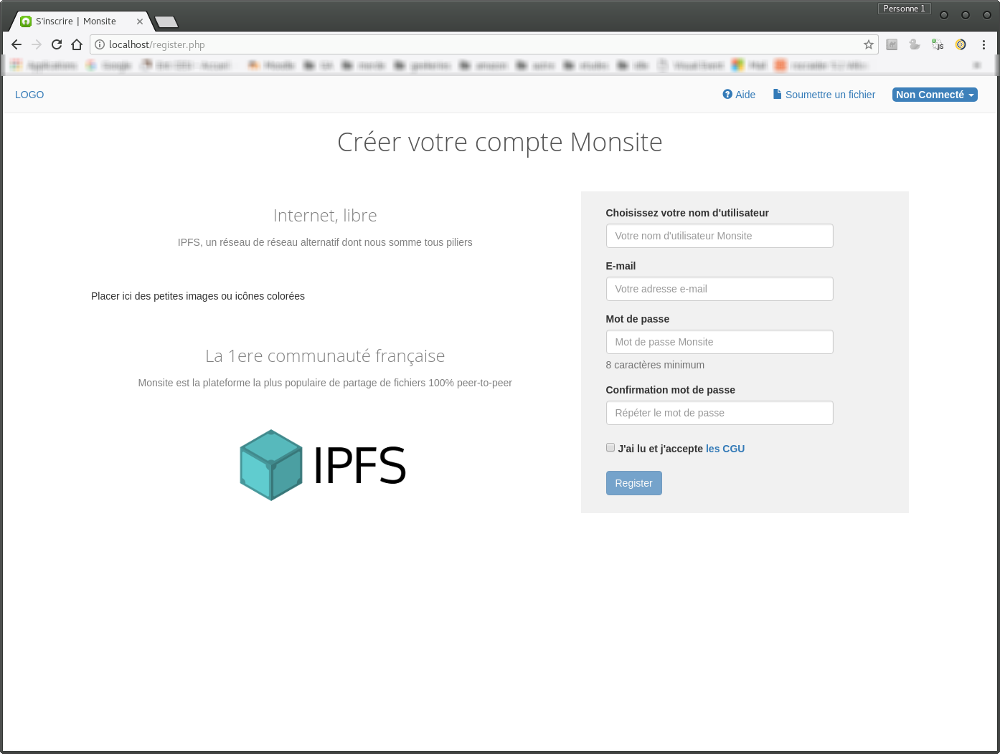
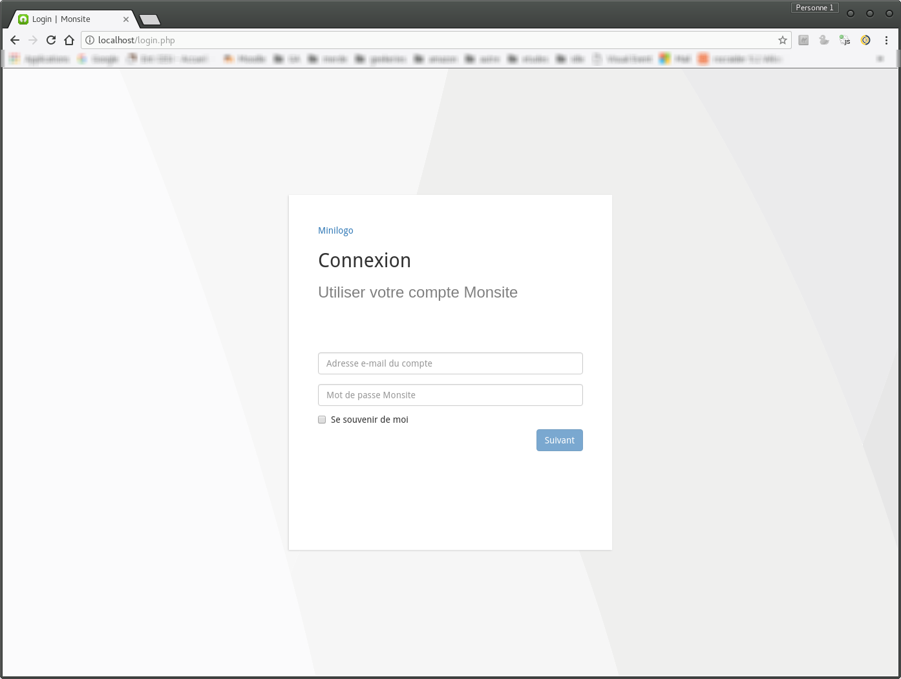

# Project no longer maintained. Will be Rewritten with Symfony, when the time will have come

New Backend Git: [here](https://bitbucket.org/yhu420/ipfs-france-website/src/master/)

New Frontend Git: [here](https://bitbucket.org/yhu420/ipfs-france-frontend/src/master)

# Site name goes here

<logo here>

<Site name> is the first site to reference IPFS files and provide an easy way to access them to every user on the net. It provides handy tools both for users and moderators to manage their content.

Even though the whole development of this site is done in english, the interface of the site will entirely be in french. Just be aware of that. If you want to implement a translation system, go ahead, but this is absolutely not a required feature for this project.

## Site Preview

Please keep in mind that I am only a developer. I have no formation in UI/UX design or anything more or less related to art. Any sorts of suggestions or contributions are welcome in this matter.

Index page:

Register page:

Login page:

## Installing

1. Start the HTTP and MySQL (or MariaDB) services on your machine
2. Make sure the Apache HTTP rewrite module is enabled to allow URL rewriting.
3. Git clone this repository somewhere on your drive
4. Run the SQL script on your machine (found in the "sql" folder at this repo's root)
5. Modify the file "http/conf/db.conf.ini" to make it match your database's configuration
6. Make the cloned "http" folder your http daemon's "http folder"
  * What I did was symlinking /srv/http (may be /var/www for you) to the repo's "http" folder
  * If you wish, to only see the result, you can simply copy the content of the "http" folder to the Apache "http folder"
7. ????
8. Profit

## Contributing

Please see TODO.md. There's a lot to do from here.

Credits to https://github.com/KevinJDurant/OpenTorrentSite.git for a part of backend
